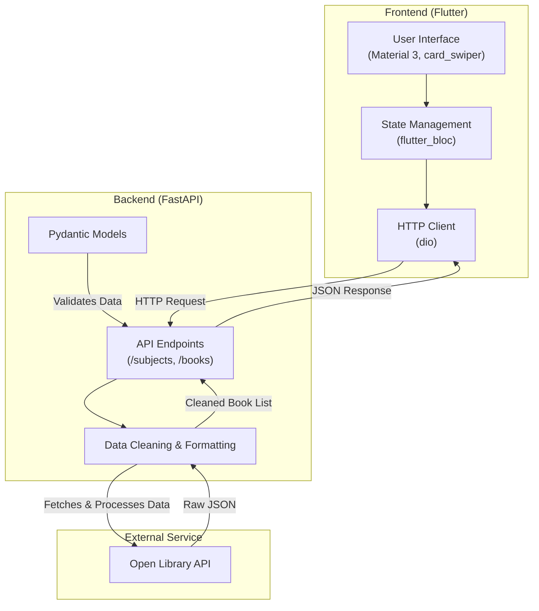
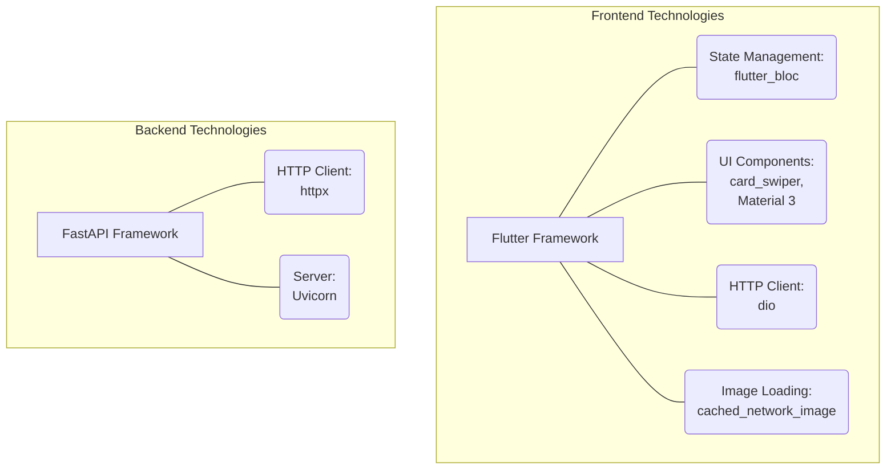
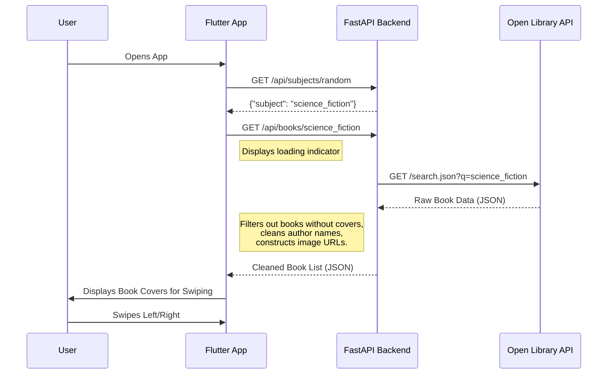

# Book Cover Speed Dating

Discover your next favorite book with a swipe! This project is a mobile application that uses a "Tinder-style" card-swiping interface to make book discovery fun and visual. Users are presented with book covers from a random subject and can swipe right to save a book or left to pass.

*(A GIF demonstrating the app's swiping interface would go here)*

## 🏛️ Tech Stack & Architecture

This project is a full-stack application composed of a Flutter frontend and a Python (FastAPI) backend. The backend acts as a proxy and data cleaner for the public Open Library API.





- **Frontend**:
    - **Framework**: Flutter
    - **State Management**: `flutter_bloc`
    - **UI**: `card_swiper` for the core swipe mechanic
    - **HTTP Client**: `dio` for network requests
    - **Image Loading**: `cached_network_image` for performance

- **Backend**:
    - **Framework**: FastAPI
    - **HTTP Client**: `httpx` for making asynchronous API calls to Open Library
    - **Server**: Uvicorn

## ✨ Features

- **Random Discovery**: Starts the user journey with a randomly selected book subject.
- **Swipe Interface**: An intuitive, visual-first way to browse books.
- **Dynamic Data**: Fetches and processes data in real-time from the Open Library API.
- **Error Handling**: Gracefully handles potential failures from the external API.
- **Clean Architecture**: Separates concerns between the UI, state management, and backend services.
- **Visual Focus**: Filters out books that do not have a cover image to ensure a consistent user experience.

## ⚙️ How It Works

The application flow is designed to be simple and engaging.



## 🚀 Getting Started

### Prerequisites

- **Flutter**: Version 3.9.2 or higher.
- **Python**: Version 3.14 or higher.
- **Poetry**: For backend dependency management.

### 1. Backend Setup

The backend server fetches and prepares the data for the frontend.

```bash
# 1. Navigate to the backend directory
cd backend

# 2. Install dependencies using Poetry
poetry install

# 3. Run the development server
poetry run uvicorn app.main:app --reload
```
The API will now be running at `http://127.0.0.1:8000`.

### 2. AWS Lambda Deployment (Optional)

The backend is also ready for deployment to AWS Lambda.

```bash
# 1. Navigate to the backend directory
cd backend

# 2. Build with SAM
sam build

# 3. Deploy to AWS
sam deploy --guided
```
See [README_LAMBDA.md](backend/README_LAMBDA.md) for more details.

### 3. Frontend Setup

The Flutter app consumes the backend API to display the books.

```bash
# 1. Navigate to the frontend directory
cd frontend

# 2. Install dependencies
flutter pub get

# 3. Run the application
# (Ensure an emulator is running or a device is connected)
flutter run
```

*Note: The backend is configured with CORS to allow requests from any origin, which simplifies development.*

## 📡 API Endpoints

The backend exposes a few simple endpoints to drive the app.

| Method | Endpoint                 | Description                                                                                                   |
|--------|--------------------------|---------------------------------------------------------------------------------------------------------------|
| `GET`  | `/api/subjects/random`   | Returns a single random subject (e.g., `{"subject": "cyberpunk"}`) to kick off the discovery process.         |
| `GET`  | `/api/books/{subject}`   | Fetches a list of books for the given subject from Open Library. It cleans the data and filters out entries without cover images. |

## 📄 License

This project is licensed under the MIT License. See the [LICENSE](LICENSE) file for details.

---
*Copyright (c) 2025 Brandon Lamer-Connolly*